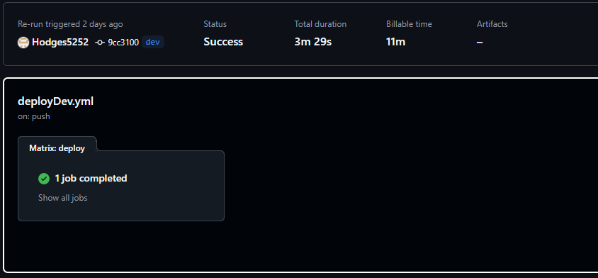

# Serverless Code Challenge

A submission for the Serverless Guru code challenge by Ethan Hodges

---

## **Table of Contents**
1. [Project Overview](#project-overview)
2. [Usage](#usage)
   - [Budget Template Example](#budget-template-example)
   - [Record Template Example](#record-template-example)
   - [Record After Budget Allocation](#record-after-budget-allocation)
3. [CI/CD Pipeline](#cicd-pipeline)
4. [API Endpoints](#api-endpoints)
5. [Future Enhancements](#future-enhancements)

---

## Project Overview

This project is a budget tracker and manager, where the user can upload budgets and track earnings that allocate amounts to follow specific budgets. 

---
## Usage
#### Budget Template Example
```json
{
    "budgetId": "budget123",
    "categories": [
        {
            "categoryName": "Food",
            "percentage": 25
        },
        {
            "categoryName": "Rent",
            "percentage": 50
        },
        {
            "categoryName": "Savings",
            "percentage": 25
        }
    ]
}
```
#### Record Template Example
```json
{
    "recordId": "record456",
    "budgetId": "budget123",
    "amount": 100,
    "date": "2024-12-04"
}

```
#### Record After Budget Allocation
```json
{
  "recordId": "record456",
  "budgetId": "budget123",
  "amount": 100,
  "date": "2024-12-02",
  "categoryAllocations": { "Food": 25, "Rent": 50, "Savings": 25 }
}

```

---

### CI/CD Pipeline

The following image shows the successful execution of the CI/CD pipeline, triggered by a push to the `dev` branch. This pipeline deploys the application using the `deployDev.yml` GitHub Actions workflow.



---
### API Endpoints

| **Method** | **Endpoint**          | **Description**               |
|------------|-----------------------|-------------------------------|
| `POST`     | `/budget`             | Create a new budget           |
| `GET`      | `/budget/{budgetId}`  | Retrieve a specific budget    |
| `PUT`      | `/budget/{budgetId}`  | Update an existing budget     |
| `DELETE`   | `/budget/{budgetId}`  | Delete a budget               |
| `POST`     | `/records`            | Create a new record           |
| `GET`      | `/records`            | Retrieve records with filters |
| `PUT`      | `/records/{recordId}` | Update a record               |
| `DELETE`   | `/records/{recordId}` | Delete a record               |
---
### Future Enhancements

Regardless of the outcome of my submission of this challenge, I had a lot of fun with this project, there's plenty more I want to do and hope to implement some of these features in the future. 

- Add user authentication and authorization for secure access to budgets.
- Introduce detailed analytics for budget and earnings tracking.
- Provide an option to export data to CSV or Excel.
- Enable integration with external payment or finance tracking APIs.
- Improve error handling with more descriptive error messages and status codes.

---
### Video

Here is the [video demonstration](https://www.youtube.com) of the code, IAC, and the usage of this API
